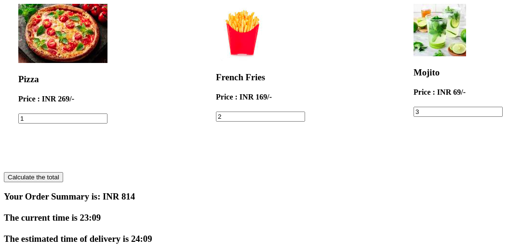

# 🥧 🧁 🍰 🎂Creating a complex component that will render 3 food item images, name of food, price and a form input to take the quantity from the user🍱 🥟 🦪 🍤
This program is a simple yet effective ReactJS app which can be used to order food items and calculate the delivery time and final expense simultaneously

- Added styling using CSS modules in which all class names are scoped locally by default.
- The food item details are read from an array of objects.


## Sections
-Event handlers have been used to help select and change the date and time values

```
  handleChange1(event){
        this.setState({value1:event.target.value})
    }
    handleChange2(event){
        this.setState({value2:event.target.value})
    }
    handleChange3(event){
        this.setState({value3:event.target.value})
    }
```


## Features

- Small and effective
- Live previews
- Cross Platform

