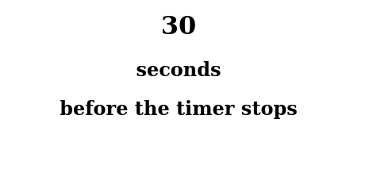
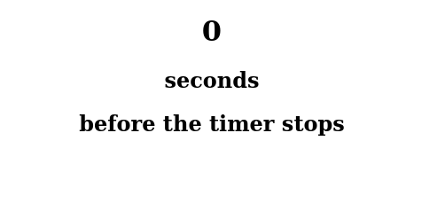

- Here is an article by me explaining what exactly is babel, hope this helps you to understand the JSX versions of code(briefed about JSX in the article too) that I upload in this folder.

> [About Babel](https://sohoxic.hashnode.dev/what-is-babel-and-how-can-you-use-it)

- Hello_react output

- Hello_JSX output

- props output

- style output

- complex_component output

-backTimer_STATES-LIFECYCLE output

UpTimer_STATES-LIFECYCLE output

